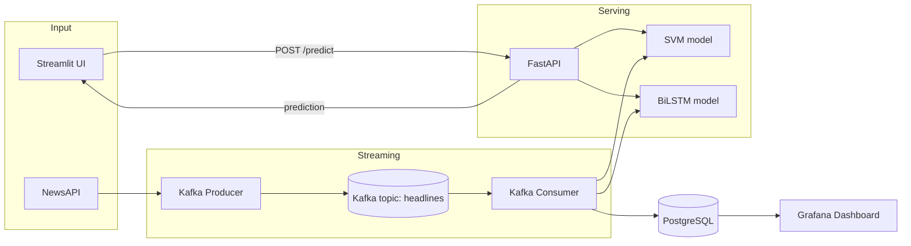

# Financial News Sentiment Pipeline

Real-time financial news sentiment analysis platform that benchmarks three
approaches -- classical ML (SVM), a custom deep learning model (BiLSTM),
and a domain-pretrained transformer (FinBERT) -- for classifying headlines
as **Positive**, **Neutral**, or **Negative**. Predictions stream through
Kafka into PostgreSQL and are visualized in Grafana.

**Live demo:** _[add your Streamlit Community Cloud link here after deploying -- see "Live Demo" below]_

## Why three models

SVM and BiLSTM were trained from scratch on the [Financial PhraseBank
dataset](https://www.researchgate.net/publication/251231364_FinancialPhraseBank-v10).
FinBERT is evaluated zero-shot (no fine-tuning) to answer a practical
question: does a model already pretrained on financial text out-perform
models trained from scratch on a few thousand labeled headlines? See
[Results](#results) below.

## Architecture



**Request-response path:** UI or client hits FastAPI, which runs one or
both models synchronously and returns a prediction.

**Streaming path:** the producer pulls live headlines from NewsAPI (or
falls back to sample data), publishes them to the `headlines` Kafka topic,
the consumer scores each headline with both models and writes the result
(headline, per-model prediction, confidence, agreement flag, timestamp) to
PostgreSQL, and Grafana dashboards read from that table.

## Results

Run `python eval.py` after populating `models/` and `dataset/` (see
[Reproducing the models](#reproducing-the-models)) to regenerate this
table on an identical, stratified 80/20 test split for all models --
earlier versions of this project evaluated SVM and BiLSTM on two
*different* splits, which made the comparison invalid; `eval.py` fixes
that.

| Model | Accuracy | Macro F1 | Weighted F1 | Avg Latency (ms/sample) |
|-------|----------|----------|-------------|--------------------------|
| SVM | 0.945 | 0.936 | 0.945 | 0.44 |
| BiLSTM | 0.714 | 0.659 | 0.709 | 27.49 |
| FinBERT (zero-shot) | 0.771 | 0.718 | 0.763 | 86.26 |

### Benchmark takeaways

- **Best overall quality:** SVM leads on Accuracy and F1 while also being the fastest model.
- **Best semantic baseline:** FinBERT zero-shot outperforms BiLSTM on all aggregate metrics without task-specific fine-tuning.
- **Latency tradeoff:** FinBERT has the highest per-sample latency, so it is best suited for offline comparison or lower-throughput workloads.

Full per-class precision/recall/F1 and confusion matrices are written to
`results/eval_report.md` and `results/confusion_matrix_*.png`.

## Project Structure

```
.
├── app.py                  # Streamlit frontend -- loads models directly (standalone,
│                           # no backend needed; also what Docker Compose runs)
├── main.py                 # FastAPI app that exposes prediction endpoints
├── svm_api.py               # SVM model loading, preprocessing, /predict/svm
├── bilstm_api.py            # BiLSTM model loading, preprocessing, /predict/bilstm
├── kafka_producer.py        # Fetches live headlines from NewsAPI, publishes to Kafka
├── kafka_consumer.py        # Consumes headlines, predicts sentiment, stores in PostgreSQL
├── eval.py                  # Evaluates SVM + BiLSTM on a shared test split, writes results/
├── finbert_baseline.py      # Zero-shot FinBERT baseline, appends to results/
├── docker-compose.yaml      # Full stack orchestration
├── Dockerfile.api           # Container image for FastAPI backend and consumer
├── Dockerfile.streamlit     # Container image for the Streamlit UI
├── requirements.txt         # Runtime dependencies
├── requirements-dev.txt     # + pytest/httpx for running tests
├── tests/
│   └── test_api.py          # FastAPI endpoint tests (models mocked, no GPU/data needed)
├── dataset/
│   └── all-data.csv         # Training dataset (gitignored, see below)
├── models/                  # Trained model artifacts (gitignored, see below)
├── grafana/
│   └── dashboard.json       # Grafana dashboard definition
└── notebooks/
    └── senti.ipynb          # Training/experimentation notebook
```

## Requirements

- Python 3.10+
- Docker and Docker Compose (for the full stack)
- Optional: a [NewsAPI](https://newsapi.org/register) free-tier key, for real headlines instead of sample data

## Reproducing the models

`dataset/` and `models/` are gitignored (the trained artifacts are a few
hundred MB combined). To reproduce them:

1. Download the Financial PhraseBank dataset (`all-data.csv`) and place
   it at `dataset/all-data.csv`.
2. Run `notebooks/senti.ipynb` end to end. It saves `svm_model.pkl`,
   `tfidf_vectorizer.pkl`, `sentiment_model.h5`, `tokenizer.pkl`, and
   `label_encoder.pkl` -- move all five into `models/`.
3. Run `python eval.py` to generate the metrics in [Results](#results).
4. Optionally run `python finbert_baseline.py` for the transformer comparison.

## Running the full stack

```
docker compose up --build
```

This starts:

- Zookeeper on `localhost:2181`
- Kafka on `localhost:9092`
- PostgreSQL on `localhost:5432`
- FastAPI on `localhost:8000`
- Kafka consumer
- Streamlit on `localhost:8501`
- Grafana on `localhost:3000` (default login: `admin` / `admin`)

To pull real headlines instead of the sample fallback, copy `.env.example`
to `.env` and set `NEWSAPI_KEY`.

## Running individual parts

**FastAPI backend only**
```
pip install -r requirements.txt
uvicorn main:app --host 0.0.0.0 --port 8000 --reload
```

**Streamlit UI only** (talks to the API above)
```
streamlit run app.py
```

**Kafka producer** (publishes live or sample headlines)
```
python kafka_producer.py            # single pass
python kafka_producer.py --loop 300 # repeat every 5 minutes
```

**Kafka consumer** expects Kafka at `kafka:9092` and PostgreSQL at
`postgres:5432` -- update `kafka_consumer.py` if running outside Docker.

## Live Demo

`app.py` loads both models directly (no FastAPI/Kafka/Postgres needed) and
is deployable to [Streamlit Community Cloud](https://share.streamlit.io)
for free:

1. Commit or LFS-track the five files in `models/` so they're available
   at deploy time.
2. On share.streamlit.io, point a new app at `app.py`.
3. Add the demo link at the top of this README.

## Testing

```
pip install -r requirements-dev.txt
pytest tests/ -v
```

Tests mock the model/tokenizer objects, so they run without the trained
artifacts present -- suitable for CI.

## API Examples

```
curl -X POST http://127.0.0.1:8000/predict/svm \
  -H "Content-Type: application/json" \
  -d '{"news":"Markets rally after strong earnings"}'

curl -X POST http://127.0.0.1:8000/predict/bilstm \
  -H "Content-Type: application/json" \
  -d '{"news":"Company shares fall after weak guidance"}'

curl -X POST http://127.0.0.1:8000/predict/compare \
  -H "Content-Type: application/json" \
  -d '{"news":"Tesla stock rises on record deliveries"}'
```

## Model Notes

- SVM: TF-IDF features (1-2 grams, 10k vocab) + `LinearSVC`, tuned via `GridSearchCV`.
- BiLSTM: tokenized/padded sequences (max length 100), class-weighted loss
  to handle the dataset's class imbalance, early stopping on validation loss.
- FinBERT: `ProsusAI/finbert`, evaluated zero-shot for comparison -- no
  fine-tuning on this dataset.
- All three share the same text cleaning: lowercase, strip non-alphabetic
  characters, remove stopwords, lemmatize.

## Troubleshooting

**Model file not found** -- confirm `models/` has all five artifacts listed above.

**Kafka connection errors** -- Kafka must be running before the producer/consumer.

**PostgreSQL connection errors** -- the consumer expects PostgreSQL at
hostname `postgres` under Docker Compose.

**Streamlit cannot reach the API** -- confirm FastAPI is running on `http://127.0.0.1:8000`.

## Tech Stack

FastAPI · Streamlit · TensorFlow/Keras · scikit-learn · Hugging Face Transformers (FinBERT) · NLTK · Kafka · PostgreSQL · Grafana · Docker Compose · pytest
